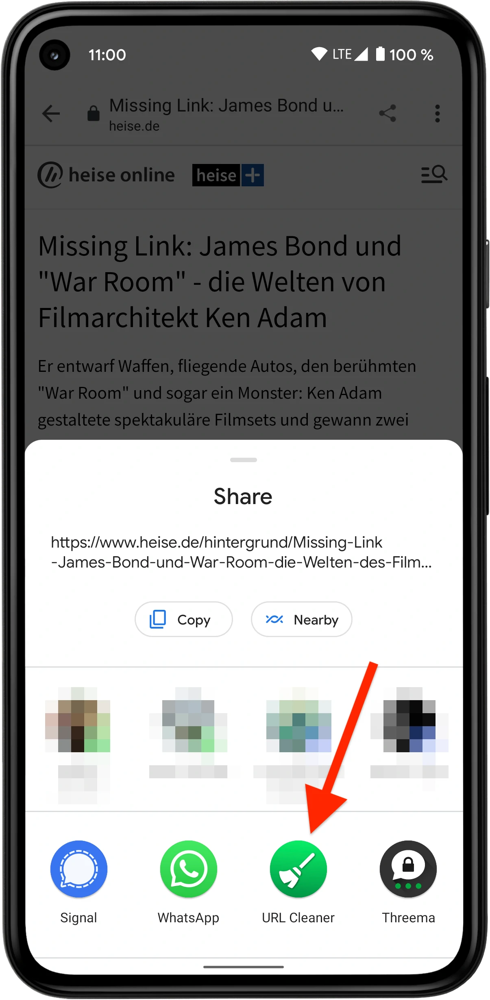

  <!-- ALL-CONTRIBUTORS-BADGE:START - Do not remove or modify this section -->

<!-- ALL-CONTRIBUTORS-BADGE:END -->

**Léon - The URL Cleaner** is an Android application which removes tracking and other obsolete
parameters from a URL before sharing. Its usage is simple, integrating into Android's standard
sharing mechanism.

Léon runs on Android 5.0 and later, is open source and does not contain any tracking or advertising
frameworks. Léon does not collect any data about you.

The benefits of removing tracking parameters are:

- Protects your and the recipient's privacy
- Improves readability of links
- Saves characters (in Tweets for example)

## Installation

- [F-Droid](https://www.f-droid.org/packages/com.svenjacobs.app.leon/)
- [Google Play Store](https://play.google.com/store/apps/details?id=com.svenjacobs.app.leon)

## How to use

When sharing a link, select **URL Cleaner** as the receiving application. Then from within URL
Cleaner share the cleaned URL to the actual target application.

## Issues & feedback

Did you find a bug or have an idea of how the app could be improved? Please report
[bugs](https://github.com/svenjacobs/leon/issues) or give
[feedback](https://github.com/svenjacobs/leon/discussions).

## Technical implementation

This app is also meant as a blueprint for modern Android development, presenting and evaluating
recommended and cutting-edge technologies, patterns and libraries such as:

- [Kotlin](https://kotlinlang.org/) programming language
- Kotlin [coroutines](https://kotlinlang.org/docs/coroutines-overview.html)
- Jetpack [Compose](https://developer.android.com/jetpack/compose)
- Jetpack [Navigation](https://developer.android.com/guide/navigation)
- [Material Design 3](https://m3.material.io/)
- Dependency Injection pattern with custom implementation
- several other Jetpack & AndroidX libraries

## Contributors

<!-- ALL-CONTRIBUTORS-LIST:START - Do not remove or modify this section -->
<!-- prettier-ignore-start -->
<!-- markdownlint-disable -->
<table>
  <tbody>
    <tr>
      <td align="center" valign="top" width="14.28%"><a href="http://svenjacobs.com"> <b>Sven Jacobs</b></a> <a href="#maintenance-svenjacobs" title="Maintenance">🚧</a> <a href="https://github.com/svenjacobs/leon/commits?author=svenjacobs" title="Code">💻</a> <a href="https://github.com/svenjacobs/leon/commits?author=svenjacobs" title="Tests">⚠️</a> <a href="https://github.com/svenjacobs/leon/commits?author=svenjacobs" title="Documentation">📖</a> <a href="#ideas-svenjacobs" title="Ideas, Planning, & Feedback">🤔</a></td>
      <td align="center" valign="top" width="14.28%"><a href="http://meet.deekshith.in"> <b>Deekshith Allamaneni</b></a> <a href="#ideas-adeekshith" title="Ideas, Planning, & Feedback">🤔</a></td>
      <td align="center" valign="top" width="14.28%"><a href="https://github.com/jimcarst"> <b>jimcarst</b></a> <a href="#ideas-jimcarst" title="Ideas, Planning, & Feedback">🤔</a></td>
      <td align="center" valign="top" width="14.28%"><a href="http://openfoxblog.leven.dev"> <b>Damon Leven</b></a> <a href="#ideas-MCWertGaming" title="Ideas, Planning, & Feedback">🤔</a></td>
      <td align="center" valign="top" width="14.28%"><a href="https://github.com/EasyVector"> <b>Yuhui Su</b></a> <a href="https://github.com/svenjacobs/leon/commits?author=EasyVector" title="Code">💻</a></td>
      <td align="center" valign="top" width="14.28%"><a href="https://github.com/bangzek"> <b>Zakaria</b></a> <a href="#ideas-bangzek" title="Ideas, Planning, & Feedback">🤔</a></td>
      <td align="center" valign="top" width="14.28%"><a href="https://github.com/pludi"> <b>Peter L.</b></a> <a href="#ideas-pludi" title="Ideas, Planning, & Feedback">🤔</a></td>
    </tr>
    <tr>
      <td align="center" valign="top" width="14.28%"><a href="https://github.com/jaswinder77"> <b>jaswinder77</b></a> <a href="#ideas-jaswinder77" title="Ideas, Planning, & Feedback">🤔</a></td>
      <td align="center" valign="top" width="14.28%"><a href="https://www.onnno.nl/"> <b>Donno</b></a> <a href="#ideas-Donnnno" title="Ideas, Planning, & Feedback">🤔</a></td>
      <td align="center" valign="top" width="14.28%"><a href="https://github.com/slootsky"> <b>slootsky</b></a> <a href="#ideas-slootsky" title="Ideas, Planning, & Feedback">🤔</a> <a href="https://github.com/svenjacobs/leon/issues?q=author%3Aslootsky" title="Bug reports">🐛</a></td>
      <td align="center" valign="top" width="14.28%"><a href="https://www.rakuten.com/r/TPSAMU?eeid=6991100"> <b>TPS</b></a> <a href="#ideas-TPS" title="Ideas, Planning, & Feedback">🤔</a> <a href="https://github.com/svenjacobs/leon/issues?q=author%3ATPS" title="Bug reports">🐛</a></td>
      <td align="center" valign="top" width="14.28%"><a href="https://github.com/Enkidu70"> <b>Robert</b></a> <a href="#ideas-Enkidu70" title="Ideas, Planning, & Feedback">🤔</a></td>
      <td align="center" valign="top" width="14.28%"><a href="http://cooper-davis.net"> <b>Ari Cooper Davis</b></a> <a href="#ideas-aricooperdavis" title="Ideas, Planning, & Feedback">🤔</a> <a href="https://github.com/svenjacobs/leon/commits?author=aricooperdavis" title="Code">💻</a> <a href="https://github.com/svenjacobs/leon/commits?author=aricooperdavis" title="Tests">⚠️</a></td>
      <td align="center" valign="top" width="14.28%"><a href="https://github.com/ChristopherKing42"> <b>Christopher King</b></a> <a href="#ideas-ChristopherKing42" title="Ideas, Planning, & Feedback">🤔</a></td>
    </tr>
    <tr>
      <td align="center" valign="top" width="14.28%"><a href="https://github.com/chel1k"> <b>chel1k</b></a> <a href="#translation-chel1k" title="Translation">🌍</a></td>
      <td align="center" valign="top" width="14.28%"><a href="https://github.com/slmb3"> <b>slmb3</b></a> <a href="#ideas-slmb3" title="Ideas, Planning, & Feedback">🤔</a></td>
      <td align="center" valign="top" width="14.28%"><a href="https://github.com/aha999"> <b>Klemen Skerbiš</b></a> <a href="#ideas-aha999" title="Ideas, Planning, & Feedback">🤔</a></td>
      <td align="center" valign="top" width="14.28%"><a href="https://github.com/chexxor"> <b>Alex Berg</b></a> <a href="#ideas-chexxor" title="Ideas, Planning, & Feedback">🤔</a></td>
      <td align="center" valign="top" width="14.28%"><a href="https://github.com/osjasmine"> <b>osjasmine</b></a> <a href="https://github.com/svenjacobs/leon/issues?q=author%3Aosjasmine" title="Bug reports">🐛</a></td>
      <td align="center" valign="top" width="14.28%"><a href="https://github.com/guerda"> <b>Philip Gillißen</b></a> <a href="https://github.com/svenjacobs/leon/issues?q=author%3Aguerda" title="Bug reports">🐛</a> <a href="#ideas-guerda" title="Ideas, Planning, & Feedback">🤔</a> <a href="https://github.com/svenjacobs/leon/commits?author=guerda" title="Code">💻</a> <a href="https://github.com/svenjacobs/leon/commits?author=guerda" title="Tests">⚠️</a></td>
      <td align="center" valign="top" width="14.28%"><a href="https://github.com/aleksandarzekovic"> <b>Aleksandar Zekovic</b></a> <a href="https://github.com/svenjacobs/leon/commits?author=aleksandarzekovic" title="Code">💻</a> <a href="https://github.com/svenjacobs/leon/commits?author=aleksandarzekovic" title="Tests">⚠️</a></td>
    </tr>
    <tr>
      <td align="center" valign="top" width="14.28%"><a href="https://github.com/ratatouille100"> <b>George Kalinin</b></a> <a href="https://github.com/svenjacobs/leon/issues?q=author%3Aratatouille100" title="Bug reports">🐛</a></td>
    </tr>
  </tbody>
</table>

<!-- markdownlint-restore -->
<!-- prettier-ignore-end -->

<!-- ALL-CONTRIBUTORS-LIST:END -->
<!-- prettier-ignore-start -->
<!-- markdownlint-disable -->

<!-- markdownlint-restore -->
<!-- prettier-ignore-end -->

<!-- ALL-CONTRIBUTORS-LIST:END -->
